# 目录

[toc]

# 仓库介绍

本仓库是大二下学期“敏捷软件开发”课程产物，以及一份看起来非常有意思的前端模板。

课程流程：甲方向产品经理提出要求—产品经历编写项目愿景书—程序员编写项目文档—程序开发—每周进行软工项目进度汇报（课程原因只汇报一到两次）—周期进行测试—最后一轮修改BUG并测试—产品汇报—软件交付（布署）

框架由专业老师自行开发，并交付给我们使用

期间使用技术如下：C#，Html5，CSS3，JavaScript，BootStrap框架，SQL Server

## 如何使用？

**PS：服务中心管理系统项目中的“DXSFWZX”源码有点小问题，用另外一个吧！（主要是懒得改了~）**

### 准备条件

在下的软件版本如下，个人认为08版本往上都能运行吧~

Visutal Studio 2019，SQL Server2016，谷歌浏览器或Microsoft Edge浏览器

### 数据连接

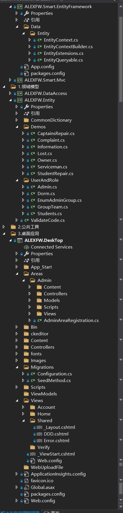

这是源码文件总览，点击**Web.config**文件

27~36行修改是SQL的连接

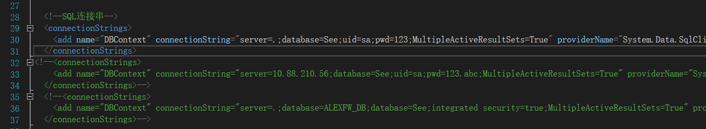

第一行是本机数据库以sa登录连接

第二行则是连接非本机的数据库

第三行则不需要输入密码进行连接

#### 连接测试

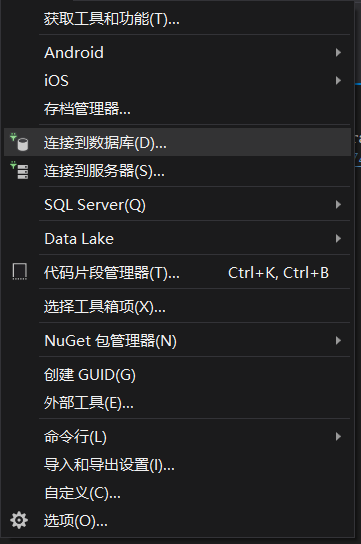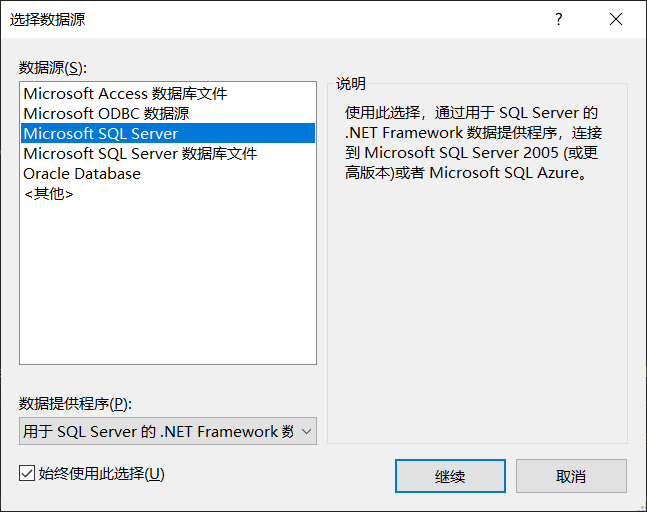

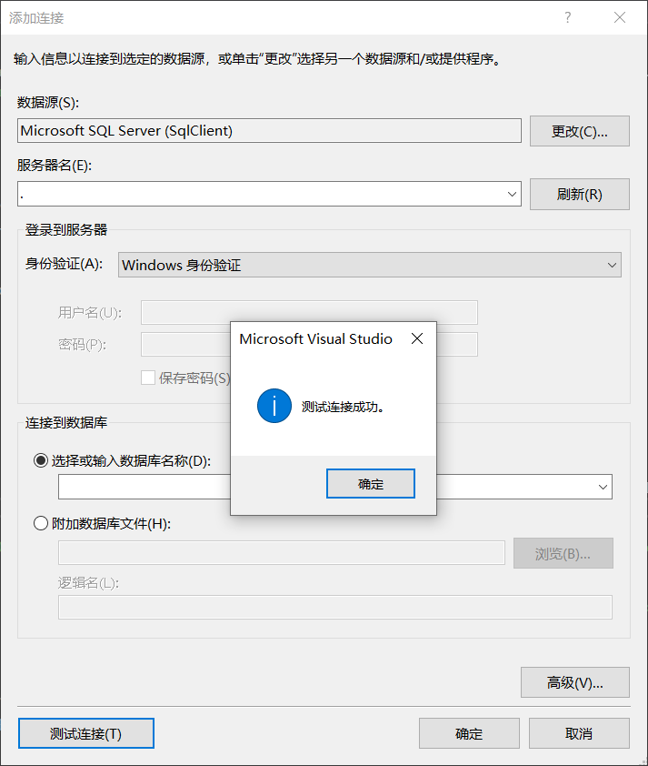

### 数据种子植入

在3.桌面应用—ALEXEFW.DeskTop—Migrations中修改，先点开“SeedMethod.cs”先

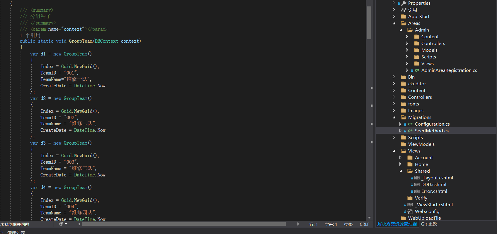

由于本平台需要登录才能增删查改，所以我在此添加撒种子程序，这样就不会出现“打卡赞需要卡赞毕业”的问题了。

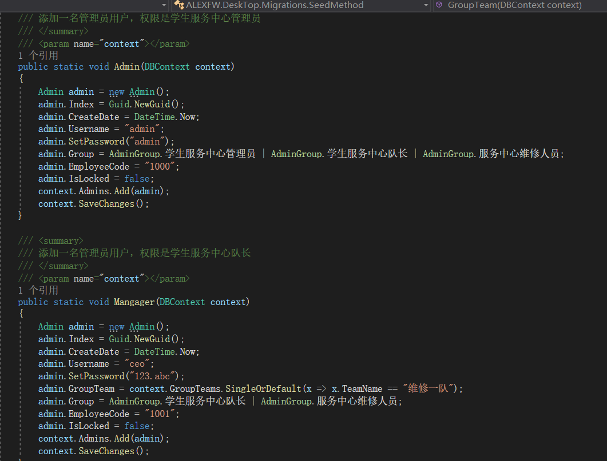

之后点开"Configuration.cs"文件

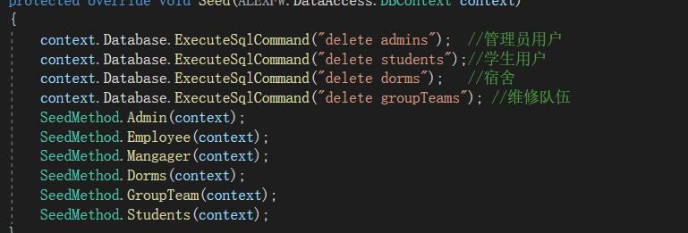

在这添加用户角色之类的。

### 程序包控制平台

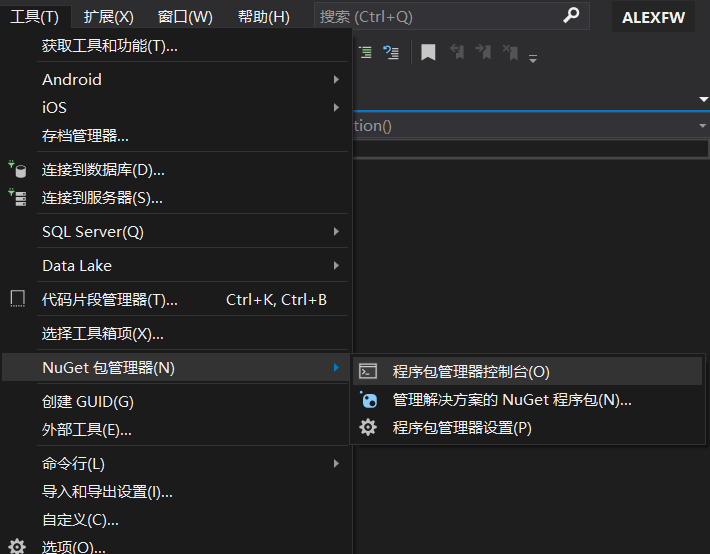

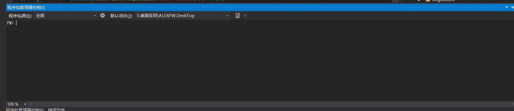

输入update-database，只不过有时候会冲突，不过不用管，直接头铁执行update-database -verbose。当然我的是本来就有，就不展示了。

### 启动（分前后台）

#### 前台：

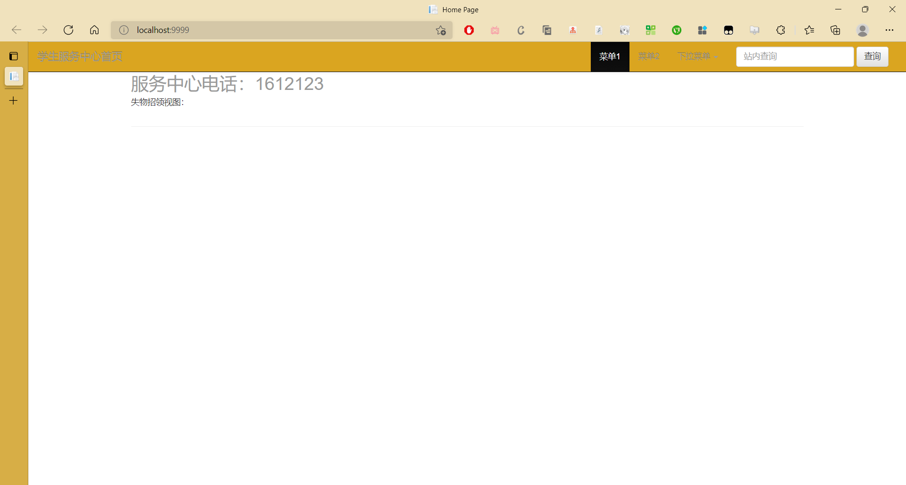

#### 后台

在网址后加个adimn就可以了：http://localhost:9999/admin

跳转，输入管理员账号和密码：

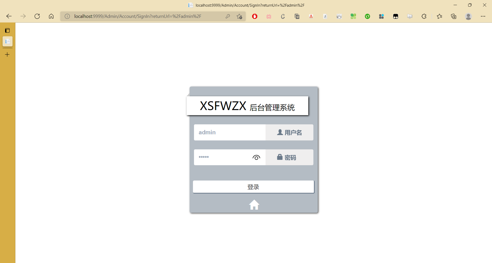

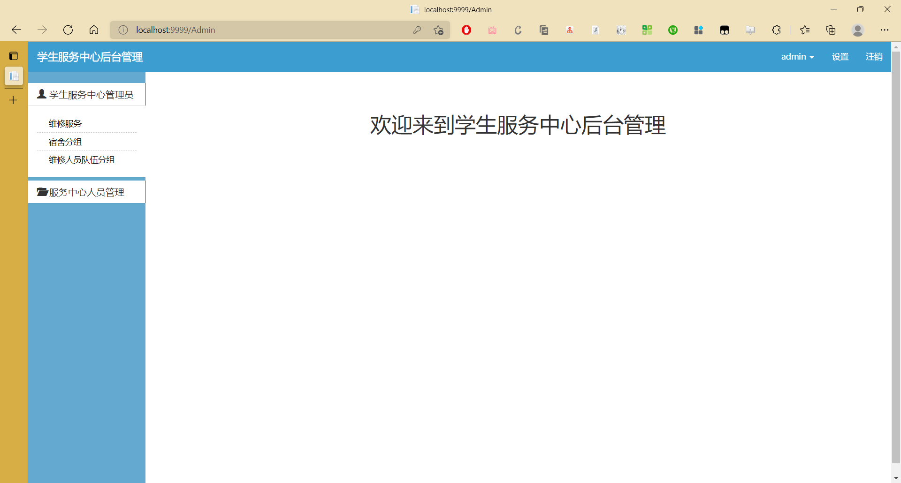

## 123完结

以上就是简要布署说明，更多内容配合项目中的文档食用即可

# ASP.NET框架介绍

[ASP.NET 教程 | 菜鸟教程 (runoob.com)](https://www.runoob.com/aspnet/aspnet-tutorial.html)

ASP.NET 是一个使用 HTML、CSS、JavaScript 和服务器脚本创建网页和网站的开发框架。

ASP.NET 支持三种不同的开发模式：
Web Pages（Web 页面）、**MVC（Model View Controller 模型-视图-控制器）**、Web Forms（Web 窗体）

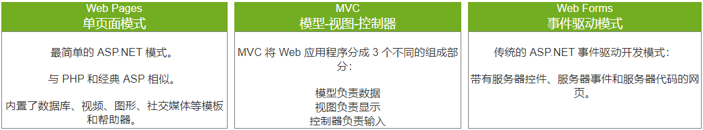

## MVC 编程模式

MVC 是三种 ASP.NET 编程模式中的一种。

MVC 是一种使用 MVC（Model View Controller 模型-视图-控制器）设计创建 Web 应用程序的模式：

* Model（模型）表示应用程序核心（比如数据库记录列表）。
* View（视图）显示数据（数据库记录）。
* Controller（控制器）处理输入（写入数据库记录）。

MVC 模式同时提供了对 HTML、CSS 和 JavaScript 的完全控制。

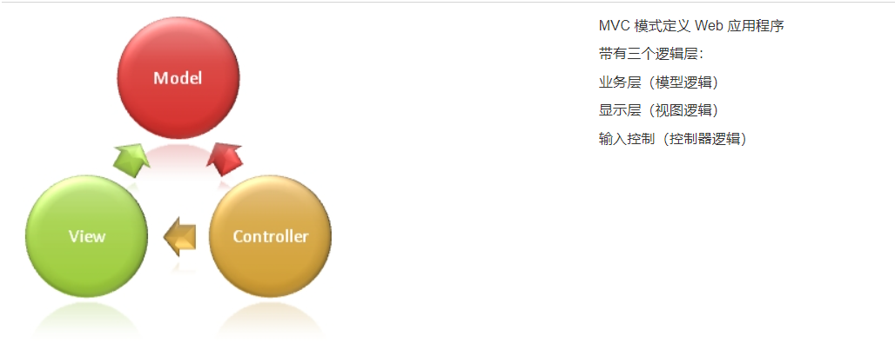

**Model**（模型）是应用程序中用于处理应用程序数据逻辑的部分。
通常模型对象负责在数据库中存取数据。

**View**（视图）是应用程序中处理数据显示的部分。
通常视图是依据模型数据创建的。

**Controller**（控制器）是应用程序中处理用户交互的部分。
通常控制器负责从视图读取数据，控制用户输入，并向模型发送数据。

MVC 分层有助于管理复杂的应用程序，因为您可以在一个时间内专门关注一个方面。例如，您可以在不依赖业务逻辑的情况下专注于视图设计。同时也让应用程序的测试更加容易。

MVC 分层同时也简化了分组开发。不同的开发人员可同时开发视图、控制器逻辑和业务逻辑。

### 优点

1. 可以为一个模型在运行时同时建立和使用多个视图。变化-传播机制可以确保所有相关的视图及时得到模型数据变化，从而使所有关联的视图和控制器做到行为同步。
2. 视图与控制器的可接插性，允许更换视图和控制器对象，而且可以根据需求动态的打开或关闭、甚至在运行期间进行对象替换。
3. 模型的可移植性。因为模型是独立于视图的，所以可以把一个模型独立地移植到新的平台工作。需要做的只是在新平台上对视图和控制器进行新的修改。

### 缺点

1. 增加了系统结构和实现的复杂性。对于简单的界面，严格遵循MVC，使模型、视图与控制器分离，会增加结构的复杂性，并可能产生过多的更新操作，降低运行效率。
2. 视图与控制器间的过于紧密的连接。视图与控制器是相互分离，但确实联系紧密的部件，视图没有控制器的存在，其应用是很有限的，反之亦然，这样就妨碍了他们的独立重用。
3. 视图对模型数据的低效率访问。依据模型操作接口的不同，视图可能需要多次调用才能获得足够的显示数据。对未变化数据的不必要的频繁访问，也将损害操作性能。
4. 目前，一般高级的界面工具或构造器不支持MVC模式。改造这些工具以适应MVC需要和建立分离的部件的代价是很高的，从而造成使用MVC的困难。

## Web Forms 对比 MVC

MVC 编程模式是对传统 ASP.NET（Web Forms）的一种轻量级的替代方案。它是轻量级的、可测试性高的框架，同时整合了所有已有的 ASP.NET 特性，比如母版页、安全性和认证。

## MVP设计模式

MVP 所对应的意义：M-Model-模型、V-View-视图、P-Presenter-主持人。Model–view–presenter (MVP) 是model–view–controller (MVC)设计模式派生出来的。MVP经常用来创建用户界面。
presenter是作为一个“中间人”的角色存在。在MVP中，所有页面显示逻辑都会被推送到presenter。

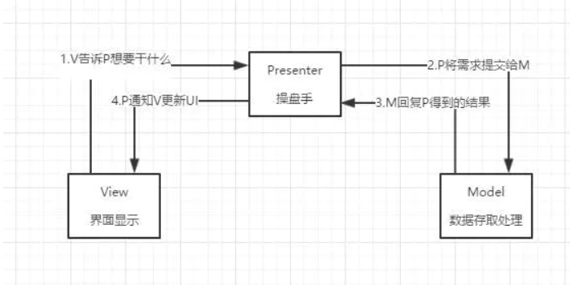

### Model

Model 是处理图形界面所需要数据的地方,大多数的数据存取逻辑都会在此处进行。

### View

视图这一层体现的很轻薄，负责显示数据、提供友好界面跟用户交互就行。MVP 下 Activity 和 Fragment 体现在了这一层，Activity 一般也就做加载 UI 视图、设置监听再交由 Presenter 处理的一些工作，所以也就需要持有相应 Presenter 的引用。在 View 上输入的数据做一些判断时，例如， EditText 的输入数据，假如是简单的非空判断则可以作为 View 层的逻辑，而当需要对 EditText 的数据进行更复杂的比较时，如从数据库获取本地数据进行判断时明显需要经过 Model 层才能返回了，所以这些细节需要自己掂量。

### Presenter

Presenter这一层处理着程序各种逻辑的分发，收到View层UI上的反馈命令、定时命令、系统命令等指令后分发处理逻辑交由业务层做具体的业务操作，然后将得到的 Model 给 View 显示。

### 特点

总的来说 , 就是 View 和 Model 之间完全隔离 , 只通过中间的 Presenter 来交换信息 , 中间的 Presenter 接收 View 发过来的请求 , 然后通知 Model 执行数据存取 , 完成后 Model 将数据提交给 Presenter , 并由 Presenter 来通知 View 更新 .   其中基本都试用接口来进行交互 . 在需要更换业务逻辑的时候 , 可以保留之前的逻辑, 实现新的即可 , 也便于测试 .

### 缺点

使用了 MVP 后 , 接口的数量会暴涨 , 代码量也相对增加 , 对于小型项目个人觉得没必要使用 .
